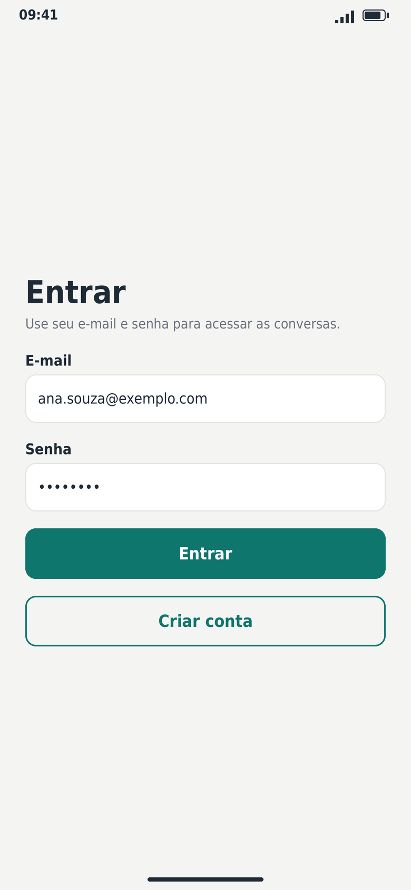
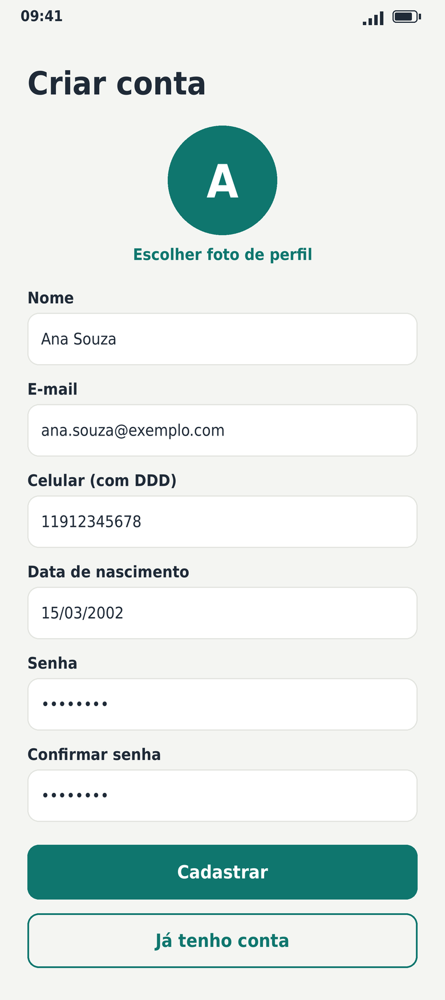
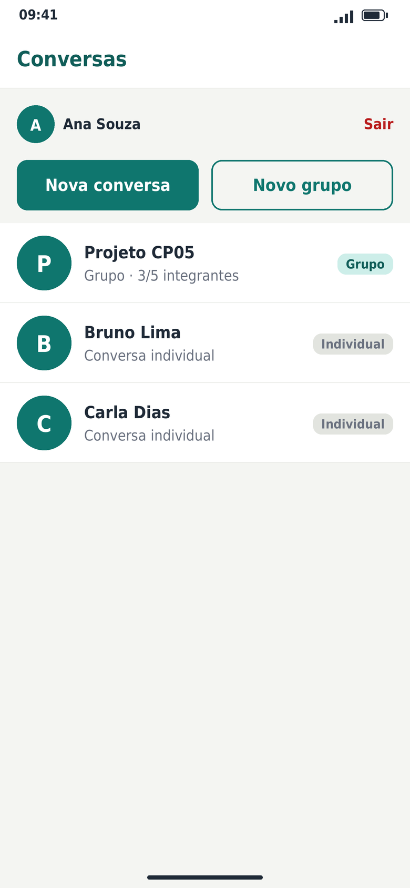
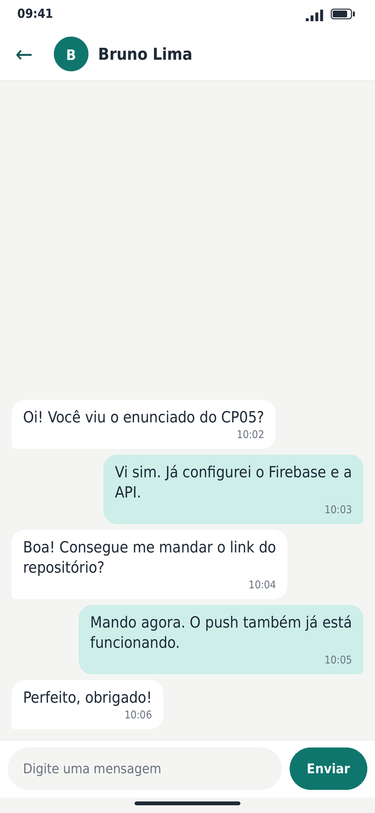
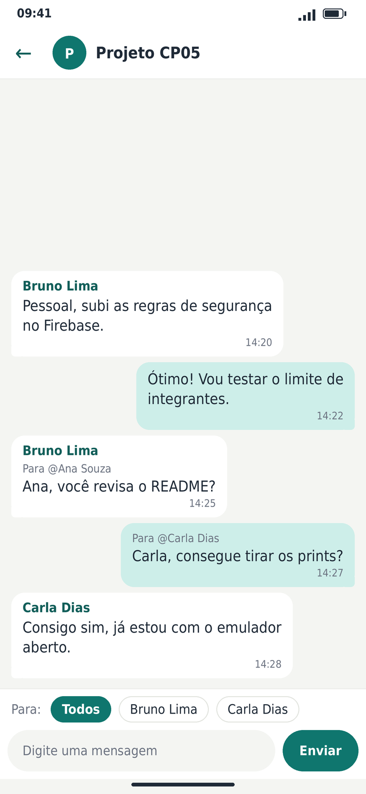
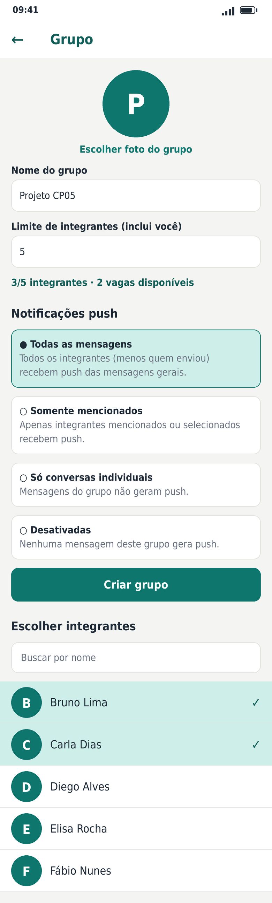
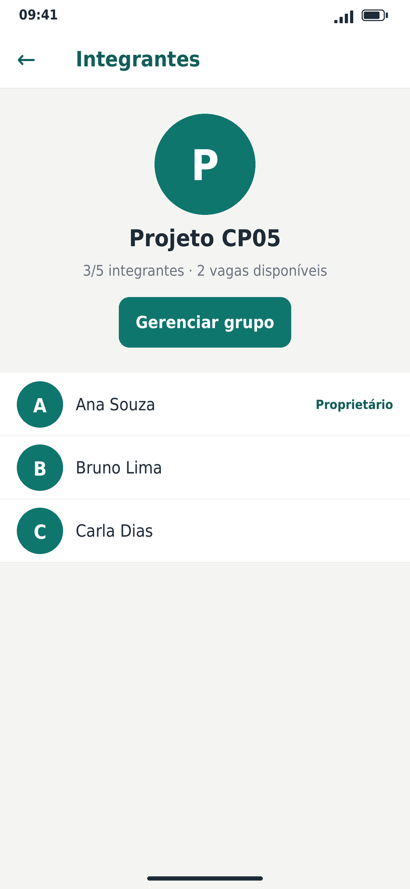
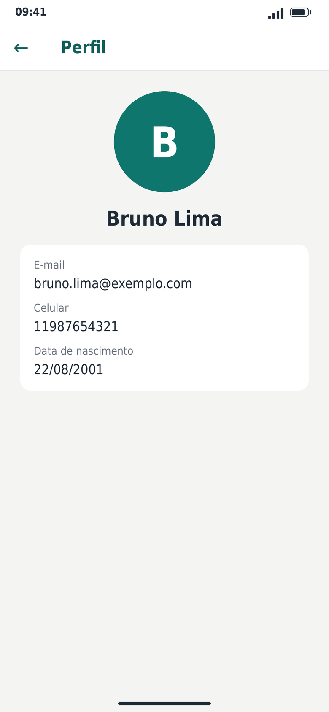
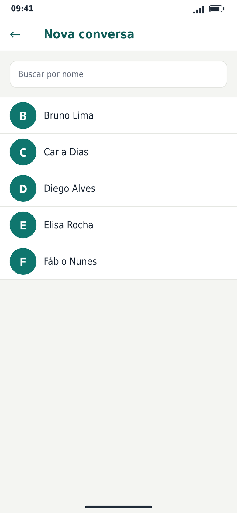
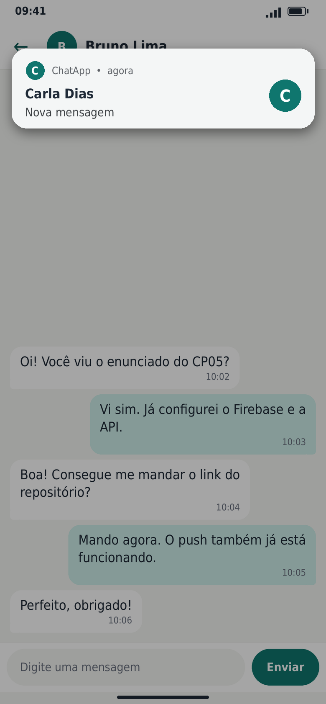

# ChatApp — Chat individual/grupo com Firebase e Push Notifications

Aplicativo de chat em **React Native + Expo + TypeScript** com **Firebase** (Authentication, Realtime Database, Cloud Firestore e Cloud Messaging) e uma **API própria** (Node.js + Express) responsável pelas operações seguras: envio de push e gerenciamento de grupos.

## Integrantes

> **GABRIEL MACHADO LACERDA  -  RM:556714  -  3ESPW**

## Tecnologias

| Camada | Tecnologia |
|---|---|
| App | React Native 0.83, **Expo SDK 55**, TypeScript (strict, sem `any`), React Navigation 7 |
| Backend (BaaS) | Firebase Authentication, Realtime Database, Cloud Firestore, Cloud Messaging |
| Push no app | `expo-notifications` (token FCM nativo no Android) |
| Fotos | **Cloudinary** (upload "unsigned", plano gratuito) |
| API | Node.js 22 + Express 5 + TypeScript + Firebase Admin SDK |
| Hospedagem da API | Render (`server/render.yaml`) — também funciona com Docker/Cloud Run (`server/Dockerfile`) |

## Responsabilidade de cada serviço

| Serviço | Uso |
|---|---|
| **Authentication** | Cadastro/login **somente e-mail e senha**, sessão persistida (AsyncStorage), identificação por `uid`, logout. |
| **Realtime Database** | `messages/{conversationId}/{messageId}` (todas as mensagens, direta e grupo) com listeners em tempo real; `members/{groupId}/{uid}` (espelho de integrantes, escrito só pela API, usado pelas regras). |
| **Cloud Firestore** | `users` (dados cadastrais), `publicProfiles` (nome/foto), `groups` (nome, foto, dono, `memberIds`, `memberLimit`, `notificationPolicy`), `directConversations`, `users/{uid}/devices` (tokens e preferências), `userGroups` e `notificationDispatches` (controle interno da API). |
| **Cloud Messaging** | Entrega dos push (app em segundo plano ou fechado) com `conversationId` e `conversationType` no `data`. |

**Por que a API faz as escritas de grupo:** as regras do RTDB não leem o Firestore e as regras do Firestore não alteram o RTDB. Validações que dependem dos dois (limite de integrantes + liberação de leitura das mensagens) são feitas na API, com transação. Isso está refletido nas regras: `groups` é **somente leitura** para o cliente.

## Estrutura do projeto

```text
src/
  components/   Avatar, Button, ChatInput, ChatMessage, ConversationItem, ErrorMessage,
                GroupMemberItem, Loading, TextField, UserItem
  screens/      Login, Register, Conversations, Users, GroupForm, Chat, GroupMembers, Profile
  services/     firebase, authService, userService, groupService, chatService,
                notificationService, imageService, apiClient
  hooks/        useAuth, useChat, useGroups, useConversations, useUsers, useNotifications
  contexts/     AuthContext
  navigation/   RootNavigator, navigationRef, types (parâmetros tipados)
  types/        user, chat, group, notification
  utils/        conversationId, groupValidation, validation, errors
server/
  src/
    app.ts, server.ts, config.ts, errors.ts
    middleware/ authenticate.ts (ID token), rateLimit.ts
    routes/     notifications.ts, groups.ts
    services/   firebaseAdmin, recipientResolver, recipientPolicy(+teste), notificationSender,
                dispatchLock (idempotência), groupService (transações)
firestore.rules   database.rules.json   firebase.json
firebaseConfig.json   .env.example   server/.env.example
```

## Configuração do Firebase

1. Crie o projeto no [console do Firebase](https://console.firebase.google.com).
2. **Authentication** → ative somente **E-mail/senha**.
3. **Firestore** e **Realtime Database** → crie os bancos (RTDB em modo bloqueado).
4. Adicione um app **Web** e copie a configuração para `firebaseConfig.json` (somente SDK cliente; nenhum segredo).
5. Adicione um app **Android** (`br.com.seugrupo.chatapp`) e baixe `google-services.json` para a raiz. Para iOS, adicione o app iOS e envie a **chave APNs** em *Configurações → Cloud Messaging*.
6. Publique as regras:
   ```bash
   npm i -g firebase-tools && firebase login
   firebase use SEU_PROJETO
   firebase deploy --only firestore:rules,database
   ```


## Instalação e execução do app

```bash
npm install                    # na raiz do projeto (onde está o package.json)
cp .env.example .env           # preencha EXPO_PUBLIC_API_URL e Cloudinary
npx expo run:android           # emulador/dispositivo (development build)
npx expo run:ios               # macOS
```

> O push **não funciona no Expo Go**. Use *development build* (`expo run:*`) ou EAS Build (`eas build --profile development`).

Em `app.json`, ajuste o `package`/`bundleIdentifier` e o `extra.eas.projectId`; coloque o `google-services.json` na raiz.

### Notificações — Android
- Emulador: use uma imagem **com Google Play** e entre com uma conta Google (sem isso não há token FCM).
- O app cria o canal `default`, pede `POST_NOTIFICATIONS` (Android 13+) e grava o token **FCM nativo** em `users/{uid}/devices/{token}` (`tokenType: 'fcm'`). A API envia com Firebase Admin (`messaging().sendEach`).

### Notificações — iOS
- Exige dispositivo físico, conta Apple Developer e chave APNs.
- O token FCM no iOS exigiria `@react-native-firebase`; aqui o app grava o **token do Expo Push Service** (`tokenType: 'expo'`), que entrega via APNs. Requer `extra.eas.projectId` e credenciais configuradas com `eas credentials`. A API trata os dois tipos de token.

## API online

- **Tecnologia:** Node.js 22 + Express 5 + TypeScript.
- **URL pública:** 
- **Health check:** 

| Método | Rota | Descrição |
|---|---|---|
| GET | `/health` | Disponibilidade (público) |
| POST | `/notifications/messages` | `{conversationId, messageId}` → valida token, mensagem e política, calcula destinatários e envia o push (idempotente) |
| POST | `/groups` | Cria grupo (`name, photoUrl, memberIds, memberLimit, notificationPolicy`) |
| POST | `/groups/:id/members` | `{uid}` — adiciona integrante (dono; respeita o limite) |
| DELETE | `/groups/:id/members/:uid` | Remove integrante (dono) ou sai do grupo |
| PATCH | `/groups/:id/settings` | Altera nome, foto, limite e política (dono) |

Todas, exceto `/health`, exigem `Authorization: Bearer <Firebase ID Token>`. Erros: `{ "code": "...", "message": "..." }`.

### Configurar, executar e publicar a API

```bash
cd server
cp .env.example .env     # apenas para uso local; nunca versione
npm install && npm run build && npm start
npm test                 # testes da política de destinatários
```

**Variáveis (somente nomes; valores só na hospedagem):** `FIREBASE_PROJECT_ID`, `FIREBASE_CLIENT_EMAIL`, `FIREBASE_PRIVATE_KEY`, `FIREBASE_DATABASE_URL`, `EXPO_ACCESS_TOKEN` (opcional).

**Credencial com privilégio mínimo:** no Google Cloud IAM crie uma conta de serviço dedicada com apenas `Cloud Datastore User`, `Firebase Realtime Database Admin` e `Firebase Cloud Messaging API Admin`; gere a chave JSON e copie `project_id`, `client_email` e `private_key` para as variáveis da hospedagem. **Nunca** commite o JSON.

**Deploy no Render:** *New → Blueprint* apontando para o repositório (usa `server/render.yaml`), preencha as variáveis secretas e confirme `/health`. O plano gratuito "dorme" após inatividade: use um monitor (ex.: UptimeRobot a cada 5 min em `/health`) ou um plano sem hibernação durante a correção.

## Política de notificações

Definida pelo proprietário em cada grupo (`notificationPolicy`) e aplicada **no servidor** (`recipientPolicy.ts`). O app nunca envia a lista de destinatários.

| Política | Quem recebe |
|---|---|
| `all_group_messages` | Mensagem geral: todos os integrantes, exceto o remetente. Mensagem direcionada: somente o integrante escolhido. |
| `mentioned_members` | Somente integrantes mencionados/selecionados. Mensagem geral não notifica. |
| `direct_messages_only` | Grupos não geram push; só conversas individuais. |
| `disabled` | Nenhuma mensagem do grupo gera push. |

Regras gerais: o remetente nunca recebe; só participantes ativos recebem; em conversa individual notifica-se o outro participante; tokens inválidos (`not-registered` / `DeviceNotRegistered`) são marcados `enabled: false`; o texto da mensagem **não** vai na notificação (corpo genérico, ex.: "Ana enviou uma mensagem"); o `data` leva `conversationId`, `conversationType` e `messageId`; tocar na notificação abre o chat correspondente (inclusive com o app fechado).

**Fluxo:** app grava a mensagem no RTDB → listeners atualizam a tela → app chama `POST /notifications/messages` → API valida o ID token, confere no RTDB que a mensagem existe e que `senderId` = usuário autenticado, lê grupo/política/tokens no Firestore, calcula destinatários e envia. A idempotência usa uma transação em `notificationDispatches/{conversationId}__{messageId}`: reenvios retornam `duplicate: true` sem novo push (um registro "travado" por mais de 60 s ou "falho" pode ser reprocessado).

## Limite de integrantes e concorrência

1. **Interface:** mostra "X/Y integrantes · N vagas disponíveis", impede selecionar além do limite e valida o inteiro (2–100). É só conveniência.
2. **API (garantia real):** `addMember` roda numa **transação do Firestore** que lê o grupo, confere `memberIds.length < memberLimit` e escreve. Se duas entradas disputam a última vaga, o Firestore reexecuta a segunda transação, que relê o grupo já cheio e responde `409 group_full`. A alteração do limite na mesma transação rejeita valores menores que o número de integrantes (`limit_below_members`).
3. **Regras:** o cliente **não escreve** em `groups`; assim ninguém contorna a API.
4. **Consistência com o RTDB:** ao adicionar, o espelho `members/{groupId}/{uid}` é criado depois da transação (com compensação se falhar); ao remover, é apagado **antes**, cortando imediatamente a leitura de novas mensagens.

## Regras de segurança

Versionadas em [`firestore.rules`](firestore.rules) e [`database.rules.json`](database.rules.json); nenhuma regra é pública.

- **Firestore:** `publicProfiles` legível por autenticados; `users` só pelo dono ou por quem tem conversa individual ou grupo em comum (`userGroups` + `hasAny`); `devices` só o dono (tokens não públicos); `directConversations` só participantes, id = dois uids ordenados (um par, uma conversa); `groups` leitura só por integrantes ativos e escrita só pela API; validação de tipos e tamanhos.
- **Realtime Database:** leitura/escrita em `messages/{conv}` apenas para integrantes do grupo (`members/{conv}/{uid}`) ou participantes do id da conversa individual; `senderId == auth.uid`; texto 1–2000 caracteres; campos fixos; mensagens imutáveis (sem editar/apagar); `createdAt` limitado.
- **Limitação documentada:** nas conversas individuais o RTDB só consegue validar o id (`uidA_uidB`), não a existência do documento no Firestore; a API exige a existência de `directConversations/{id}` antes de enviar push.

## Prints das telas

| Login | Cadastro | Conversas |
|---|---|---|
|  |  |  |

| Chat direto | Chat em grupo | Criação de grupo |
|---|---|---|
|  |  |  |

| Integrantes | Perfil | Usuários |
|---|---|---|
|  |  |  |

## Evidência de notificação recebida


